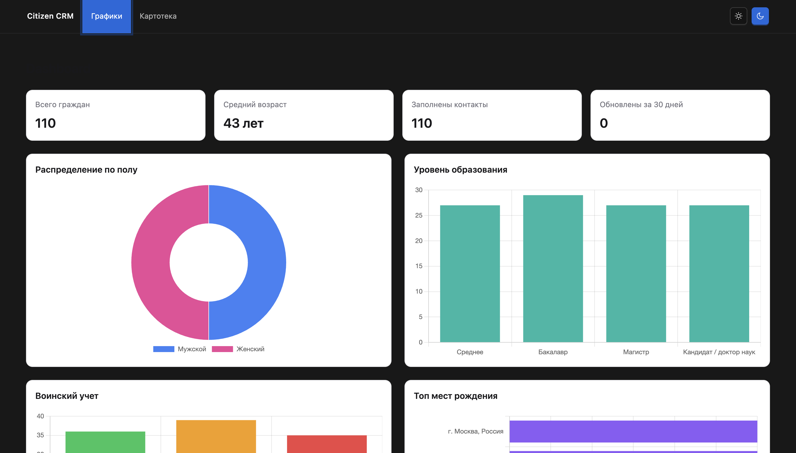
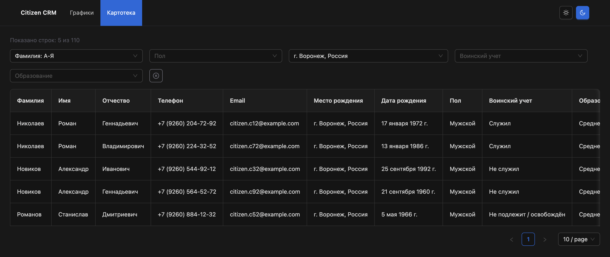
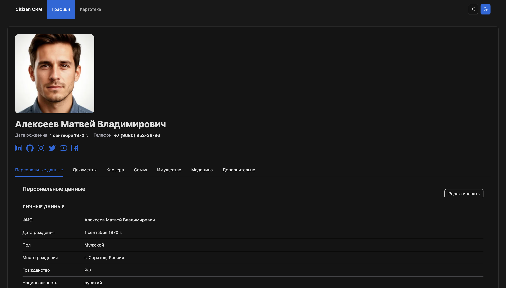
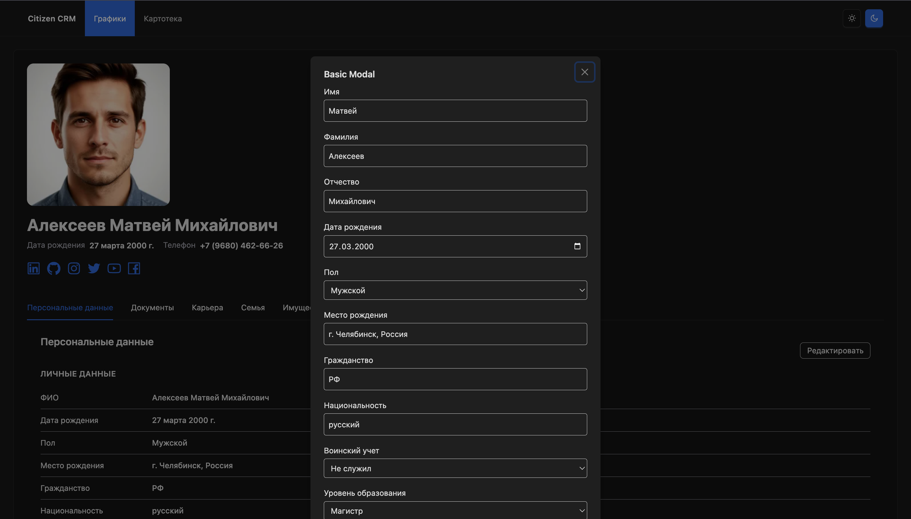

# Test CRM

## Краткий обзор приложения









Тестовое задание на React/TypeScript: интерфейс для учета граждан с таблицей, карточкой, разделами данных и главной страницей с показателями.

## О проекте

В рамках работы реализовано небольшое CRM-приложение для учета граждан.  
Проект включает:

- главную страницу с ключевыми показателями и графиками;
- таблицу граждан с фильтрацией и сортировкой;
- карточку гражданина с разбивкой на тематические вкладки;
- формы редактирования данных внутри карточки;
- mock API для имитации серверного взаимодействия.

Структура и наполнение переработаны на основе указанного в задании референса, но с более современной компоновкой, навигацией и визуальной подачей.

## Что реализовано по ТЗ

### 1. Таблица с параметрами учета

Реализована таблица граждан со следующими полями:

- фамилия;
- имя;
- отчество;
- телефон;
- email;
- место рождения;
- дата рождения;
- пол;
- воинский учет;
- образование;
- гражданство;
- национальность;
- дата создания;
- дата обновления.

Дополнительно реализовано:

- переход из строки таблицы в карточку гражданина;
- сортировка;
- фильтрация по полу, месту рождения, воинскому учету и образованию;
- отображение количества строк после фильтрации.

### 2. Карточка гражданина с разделами и полями ввода

Карточка гражданина состоит из вкладок и секций. В текущей реализации вынесены отдельные блоки:

- обзор / персональные данные;
- документы;
- карьера и образование;
- семья;
- имущество;
- медицина;
- дополнительная информация.

Во вкладках отображаются и редактируются различные типы данных:

- текстовые поля;
- даты;
- списки `select`;
- многострочные поля `textarea`.

Для форм редактирования подготовлены schema-описания, что позволяет переиспользовать одну и ту же универсальную форму для разных сущностей.

### 3. Главная страница с показателями

Реализована страница `Dashboard`, на которой отображаются:

- общее количество граждан;
- средний возраст;
- количество граждан с заполненными контактами;
- количество карточек, обновленных за последние 30 дней.

Также добавлены графики:

- распределение по полу;
- распределение по уровню образования;
- распределение по воинскому учету;
- топ мест рождения;
- динамика создания карточек.

## Дополнительное наполнение форм и списков

Для более высокой детализации в проект были добавлены не только базовые персональные поля, но и связанные группы данных:

- адреса;
- паспорта;
- водительские удостоверения;
- опыт работы;
- образование;
- члены семьи;
- имущество и транспорт;
- медицинские записи;
- хобби;
- языки;
- социальные профили.

Это позволяет показать работу с большим количеством различных полей и списков, как требовалось в задании.

## Выбор технологий

В проекте использованы следующие технологии:

- `React` - основа пользовательского интерфейса;
- `TypeScript` - типизация данных, пропсов, схем форм и API-ответов;
- `Vite` - сборка и локальная разработка;
- `React Router` - маршрутизация между страницами;
- `TanStack Query` - работа с запросами и кешированием данных;
- `Ant Design` - базовые UI-компоненты;
- `Tailwind CSS` - быстрая кастомизация и адаптивная стилизация;
- `Zustand` - локальное состояние интерфейса;
- `React Hook Form` - работа с формами;
- `Chart.js` + `react-chartjs-2` - визуализация агрегированных данных на dashboard;
- `MSW` - mock API для имитации сервера.

## Почему выбран такой стек

- `React + TypeScript` хорошо подходят для интерфейсов со сложной структурой данных и большим числом форм.
- `TanStack Query` упрощает работу с асинхронными запросами и дает удобную модель для перехода от mock API к реальному backend.
- `Ant Design` ускоряет разработку таблиц, вкладок, селектов и модальных окон.
- `Tailwind CSS` позволяет быстрее собирать кастомный внешний вид без тяжелой ручной CSS-архитектуры.
- `MSW` дает возможность разрабатывать приложение как будто оно уже подключено к backend, но без реального сервера.

## Как использован mock для имитации сервера

Для эмуляции backend в проекте используется `MSW (Mock Service Worker)`.

### Как это устроено

- основные mock-данные граждан лежат в `src/mocks/mock-data/citizens-mock.json`;
- связанные данные по вкладкам лежат в `src/mocks/mock-data/external-tables/citizen-external-groups.json`;
- обработчики API находятся в `src/mocks/handlers.ts`;
- запуск mock worker выполняется в `src/main.tsx` только в dev-режиме.

### Какие запросы мокируются

Примеры маршрутов:

- `GET /api/citizens`
- `GET /api/citizens/:id`
- `GET /api/citizens/:citizenId/documents`
- `GET /api/citizens/:citizenId/career`
- `GET /api/citizens/:citizenId/family`
- `GET /api/citizens/:citizenId/assets`
- `GET /api/citizens/:citizenId/medicine`
- `GET /api/citizens/:citizenId/additional`

Такой подход позволил:

- разрабатывать приложение независимо от готовности backend;
- сразу строить код вокруг API-запросов, а не вокруг захардкоженных данных внутри компонентов;
- подготовить проект к дальнейшей замене mock-слоя на реальный сервер без полного переписывания UI.

## Архитектурный подход

В проекте использовано разделение по слоям ответственности:

- `pages` - страницы приложения;
- `components` - UI и feature-компоненты;
- `hooks` - переиспользуемая логика;
- `schema` - описания полей для форм;
- `types` - типы моделей и интерфейсы;
- `mocks` - mock API и данные;
- `constants`, `data`, `utils` - вспомогательные сущности.

Такой подход упрощает расширение проекта и добавление новых сущностей, вкладок и форм.

## Основные маршруты

- `/dashboard` - главная страница с показателями;
- `/citizens` - таблица граждан;
- `/profile` - карточка гражданина.

## Запуск проекта

### Установка зависимостей

```bash
npm install
```

### Запуск в режиме разработки

```bash
npm run dev
```

### Сборка проекта

```bash
npm run build
```

### Проверка линтера

```bash
npm run lint
```

## Итог

В результате выполнена фронтенд-часть тестового задания с:

- таблицей учета граждан;
- карточкой с разделами и формами;
- dashboard со сводными показателями;
- mock API, имитирующим работу сервера;
- расширенным набором полей и списков для демонстрации структуры данных.


---
